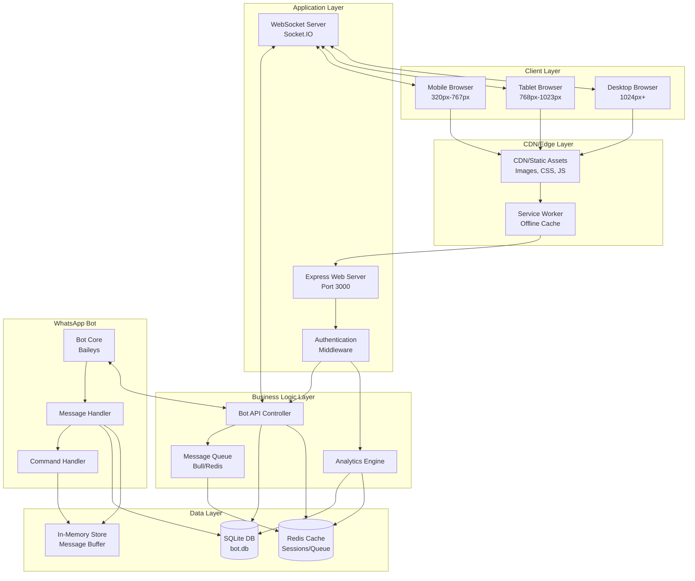
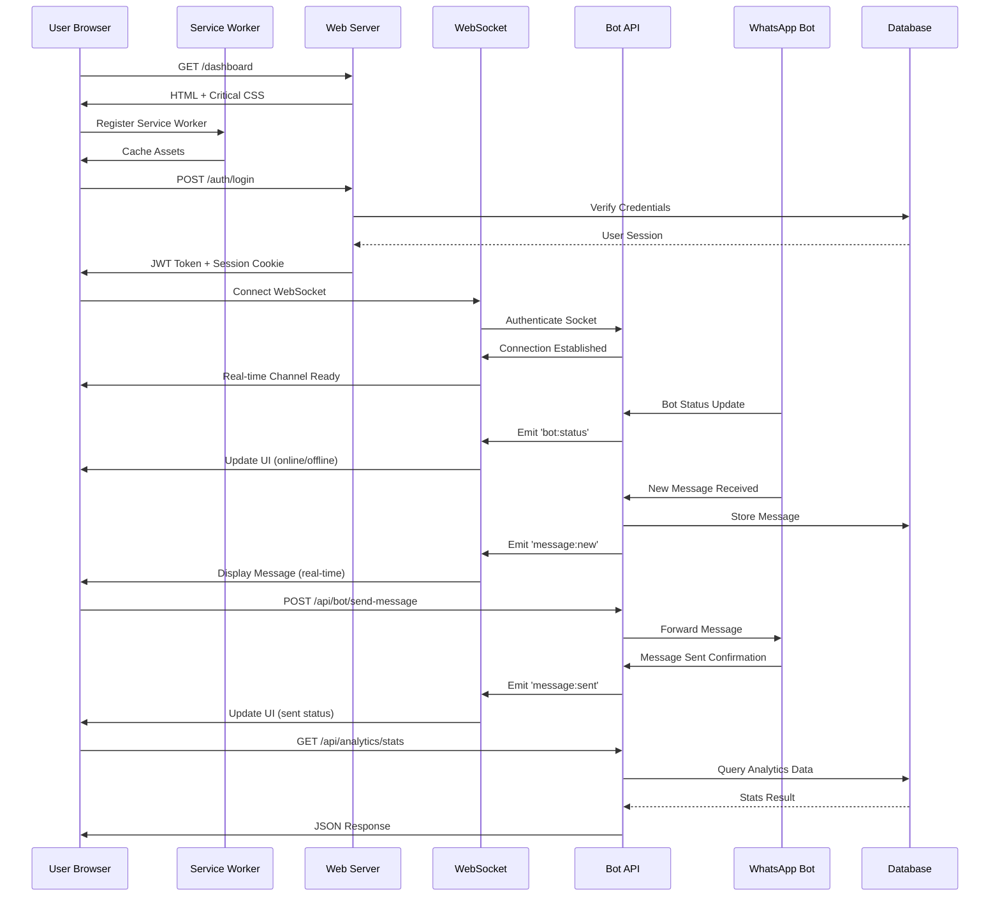

# Design Document: WhatsApp Bot Dashboard

## Executive Summary

This document specifies the design for a responsive web dashboard to manage and monitor a WhatsApp bot built on Node.js (similar to WhatsAppBotMultiDevice). The dashboard provides real-time monitoring, bot control, message management, and analytics through a modern, performant web interface accessible across all devices (mobile 320px+, tablet 768px+, desktop 1024px+, large screens 1440px+).

The design prioritizes Core Web Vitals (LCP <2.5s, INP <100ms, CLS <0.1), 60fps animations, WCAG 2.1 AA accessibility, and a comprehensive design system with light/dark mode support. The architecture uses a mobile-first responsive strategy with WebSocket-based real-time updates, optimized asset delivery, and progressive enhancement for offline scenarios.

Target users are WhatsApp bot administrators who need to monitor bot activity, manage groups, view analytics, and control bot behavior from any device. The dashboard serves as a SaaS-style admin interface with role-based access control.

## Overview

The WhatsApp Bot Dashboard is a full-stack web application consisting of:

- **Frontend**: Responsive SPA with real-time updates, built using modern web standards
- **Backend**: Node.js/Express API server with WebSocket support for live data streaming
- **Data Layer**: Integration with existing bot's SQLite database and in-memory stores
- **Real-time Engine**: Socket.IO for bidirectional communication between bot and dashboard

The dashboard provides comprehensive bot management capabilities including connection status monitoring, message logs, group management, user analytics, command execution, and system health metrics.

## Architecture

### System Architecture Diagram



### Main Application Flow



## Responsive Strategy

### Breakpoint System

```pascal
STRUCTURE BreakpointSystem
  mobile_small: 320px    // iPhone SE, small phones
  mobile: 375px          // Standard mobile (iPhone 12/13)
  mobile_large: 428px    // Large phones (iPhone 14 Pro Max)
  tablet: 768px          // iPad portrait, tablets
  tablet_large: 1024px   // iPad landscape, small laptops
  desktop: 1280px        // Standard desktop
  desktop_large: 1440px  // Large desktop
  desktop_xl: 1920px     // Full HD displays
END STRUCTURE
```

### Layout Strategy

**Approach**: Mobile-first progressive enhancement

**Rationale**:

- 60% of WhatsApp users access from mobile devices
- Mobile-first ensures core functionality works on constrained devices
- Progressive enhancement adds features for larger screens without breaking mobile
- Easier to scale up than scale down
- Better performance on low-end devices

### Responsive Layout Grid

```pascal
STRUCTURE ResponsiveGrid
  // Mobile (320px-767px)
  mobile_columns: 4
  mobile_gutter: 16px
  mobile_margin: 16px

  // Tablet (768px-1023px)
  tablet_columns: 8
  tablet_gutter: 24px
  tablet_margin: 32px

  // Desktop (1024px+)
  desktop_columns: 12
  desktop_gutter: 32px
  desktop_margin: 48px

  // Large Desktop (1440px+)
  desktop_large_columns: 12
  desktop_large_gutter: 40px
  desktop_large_margin: 64px
END STRUCTURE
```

### Touch & Interaction Targets

```pascal
STRUCTURE TouchTargets
  // Minimum touch target sizes (WCAG 2.1 AA)
  minimum_size: 44px × 44px
  comfortable_size: 48px × 48px

  // Spacing between interactive elements
  minimum_spacing: 8px
  comfortable_spacing: 16px

  // Tap gesture handling
  tap_delay: 0ms              // Remove 300ms delay
  double_tap_threshold: 300ms
  long_press_threshold: 500ms

  // Hover states (desktop only)
  hover_transition: 150ms ease-out

  // Focus indicators (keyboard navigation)
  focus_outline: 2px solid primary_color
  focus_offset: 2px
END STRUCTURE
```

### Viewport Handling

```pascal
PROCEDURE HandleViewportSafety
  // Handle notches and safe areas (iPhone X+)
  USE viewport-fit=cover
  USE safe-area-inset-top
  USE safe-area-inset-bottom
  USE safe-area-inset-left
  USE safe-area-inset-right

  // Dynamic viewport units for mobile browsers
  USE dvh (dynamic viewport height)  // Accounts for browser chrome
  USE svh (small viewport height)    // Smallest possible viewport
  USE lvh (large viewport height)    // Largest possible viewport

  // Prevent zoom on input focus (iOS)
  SET input_font_size >= 16px

  // Handle orientation changes
  ON orientation_change DO
    RECALCULATE layout_dimensions
    ADJUST scroll_position
    TRIGGER resize_event
  END ON
END PROCEDURE
```

### Fluid Typography System

```pascal
STRUCTURE FluidTypography
  // Base font size: 16px (1rem)
  base_size: 16px

  // Fluid scaling using clamp()
  // Formula: clamp(min, preferred, max)

  heading_1: clamp(32px, 5vw + 1rem, 48px)      // 32px-48px
  heading_2: clamp(28px, 4vw + 1rem, 40px)      // 28px-40px
  heading_3: clamp(24px, 3vw + 1rem, 32px)      // 24px-32px
  heading_4: clamp(20px, 2.5vw + 1rem, 28px)    // 20px-28px
  heading_5: clamp(18px, 2vw + 1rem, 24px)      // 18px-24px
  heading_6: clamp(16px, 1.5vw + 1rem, 20px)    // 16px-20px

  body_large: clamp(18px, 1.5vw + 1rem, 20px)   // 18px-20px
  body: 16px                                     // Fixed
  body_small: clamp(14px, 1vw + 0.5rem, 16px)   // 14px-16px
  caption: clamp(12px, 0.8vw + 0.5rem, 14px)    // 12px-14px

  // Line heights (unitless for scalability)
  line_height_tight: 1.2
  line_height_normal: 1.5
  line_height_relaxed: 1.75

  // Letter spacing
  letter_spacing_tight: -0.02em
  letter_spacing_normal: 0
  letter_spacing_wide: 0.05em
END STRUCTURE
```

### Image Optimization Strategy

```pascal
PROCEDURE OptimizeImages
  // Responsive images with srcset
  DEFINE image_sizes = [320, 640, 768, 1024, 1280, 1920]

  FOR EACH image IN dashboard_images DO
    GENERATE srcset WITH sizes image_sizes
    SET sizes_attribute = "(max-width: 768px) 100vw,
                           (max-width: 1024px) 50vw,
                           33vw"

    // Art direction for different layouts
    IF image REQUIRES different_crops THEN
      USE picture_element WITH
        source_mobile: cropped_for_portrait
        source_tablet: cropped_for_landscape
        source_desktop: full_image
    END IF

    // Format selection
    USE modern_formats = [webp, avif]
    PROVIDE fallback_format = jpeg

    // Lazy loading
    SET loading = "lazy" FOR below_fold_images
    SET loading = "eager" FOR above_fold_images

    // Blur placeholder
    GENERATE low_quality_placeholder (20px width)
    APPLY blur_effect UNTIL full_image_loads
  END FOR
END PROCEDURE
```

## Performance Blueprint

### Core Web Vitals Targets

```pascal
STRUCTURE PerformanceTargets
  // Largest Contentful Paint (LCP)
  lcp_target: 2.5s
  lcp_good: < 2.5s
  lcp_needs_improvement: 2.5s - 4.0s
  lcp_poor: > 4.0s

  // Interaction to Next Paint (INP)
  inp_target: 100ms
  inp_good: < 200ms
  inp_needs_improvement: 200ms - 500ms
  inp_poor: > 500ms

  // Cumulative Layout Shift (CLS)
  cls_target: 0.1
  cls_good: < 0.1
  cls_needs_improvement: 0.1 - 0.25
  cls_poor: > 0.25

  // First Contentful Paint (FCP)
  fcp_target: 1.8s

  // Time to Interactive (TTI)
  tti_target: 3.8s

  // Total Blocking Time (TBT)
  tbt_target: 200ms

  // Animation Frame Rate
  target_fps: 60
  frame_budget: 16.67ms
END STRUCTURE
```

### Asset Optimization Strategy

```pascal
PROCEDURE OptimizeAssets
  // JavaScript optimization
  APPLY code_splitting BY route
  APPLY tree_shaking TO remove_unused_code
  APPLY minification WITH terser
  APPLY compression WITH brotli (level 11) OR gzip (level 9)

  SET bundle_size_limits = {
    main_bundle: 150KB (gzipped),
    route_chunk: 50KB (gzipped),
    vendor_chunk: 200KB (gzipped)
  }

  // CSS optimization
  EXTRACT critical_css FOR above_fold_content
  INLINE critical_css IN html_head
  DEFER non_critical_css
  APPLY css_minification
  REMOVE unused_css WITH purgecss

  // Font optimization
  USE font_display = "swap"
  PRELOAD critical_fonts
  SUBSET fonts TO used_characters
  USE woff2_format (best compression)

  // Preloading strategy
  PRELOAD critical_resources = [
    hero_image,
    critical_fonts,
    main_css,
    main_js
  ]

  PREFETCH likely_next_pages = [
    analytics_page,
    messages_page
  ]

  PRECONNECT external_origins = [
    cdn_domain,
    api_domain,
    websocket_domain
  ]
END PROCEDURE
```

### Animation Performance

```pascal
PROCEDURE OptimizeAnimations
  // Use GPU-accelerated properties only
  ALLOWED_PROPERTIES = [transform, opacity]
  AVOID_PROPERTIES = [width, height, top, left, margin, padding]

  // CSS containment for layout optimization
  APPLY contain = "layout style paint" TO animated_elements

  // will-change optimization
  PROCEDURE ApplyWillChange(element)
    ON animation_start DO
      SET element.will_change = "transform, opacity"
    END ON

    ON animation_end DO
      REMOVE element.will_change  // Free GPU memory
    END ON
  END PROCEDURE

  // Reduced motion support
  IF user_prefers_reduced_motion THEN
    DISABLE decorative_animations
    REDUCE animation_duration BY 80%
    USE instant_transitions
  END IF

  // Frame rate monitoring
  PROCEDURE MonitorFrameRate
    MEASURE frame_time
    IF frame_time > 16.67ms THEN
      LOG performance_warning
      REDUCE animation_complexity
    END IF
  END PROCEDURE

  // Intersection Observer for scroll animations
  PROCEDURE AnimateOnScroll(elements)
    CREATE observer WITH threshold = 0.1

    FOR EACH element IN elements DO
      WHEN element INTERSECTS viewport DO
        TRIGGER animation
        UNOBSERVE element  // Prevent re-triggering
      END WHEN
    END FOR
  END PROCEDURE
END PROCEDURE
```

### Lazy Loading Strategy

```pascal
PROCEDURE ImplementLazyLoading
  // Image lazy loading
  FOR EACH image BELOW fold DO
    SET loading = "lazy"
    SET decoding = "async"
    USE intersection_observer AS fallback
  END FOR

  // Component lazy loading
  LAZY_LOAD_COMPONENTS = [
    analytics_charts,      // Load when analytics tab opens
    message_history,       // Load when scrolling to older messages
    settings_panel,        // Load when settings clicked
    export_functionality   // Load on demand
  ]

  // Route-based code splitting
  DEFINE routes = {
    "/dashboard": () => import("./Dashboard.js"),
    "/messages": () => import("./Messages.js"),
    "/analytics": () => import("./Analytics.js"),
    "/settings": () => import("./Settings.js")
  }

  // Data pagination
  PROCEDURE LoadMessages(page, limit)
    SET page_size = 50
    LOAD messages FROM (page * page_size) TO ((page + 1) * page_size)

    // Infinite scroll with intersection observer
    WHEN user_scrolls_to_bottom DO
      LOAD next_page
    END WHEN
  END PROCEDURE
END PROCEDURE
```

### Offline Support Strategy

```pascal
PROCEDURE ImplementOfflineSupport
  // Service Worker caching strategy
  DEFINE cache_strategies = {
    static_assets: "cache_first",      // HTML, CSS, JS, fonts
    api_data: "network_first",         // Fresh data preferred
    images: "cache_first",             // Images rarely change
    analytics: "network_only"          // Always fresh
  }

  // Cache versioning
  SET cache_version = "v1.0.0"

  ON service_worker_install DO
    PRECACHE critical_assets = [
      "/",
      "/dashboard",
      "/offline.html",
      "/css/critical.css",
      "/js/main.js",
      "/fonts/inter-var.woff2"
    ]
  END ON

  ON service_worker_activate DO
    DELETE old_caches WHERE version != cache_version
  END ON

  // Offline fallback
  ON fetch_error DO
    IF request.destination == "document" THEN
      RETURN cached_offline_page
    ELSE IF request.destination == "image" THEN
      RETURN cached_placeholder_image
    ELSE
      RETURN cached_response OR error_response
    END IF
  END ON

  // Background sync for offline actions
  PROCEDURE QueueOfflineAction(action)
    STORE action IN indexedDB
    REGISTER background_sync_tag = "sync-actions"

    ON network_restored DO
      RETRIEVE queued_actions FROM indexedDB
      FOR EACH action IN queued_actions DO
        EXECUTE action
        IF success THEN
          REMOVE action FROM indexedDB
        END IF
      END FOR
    END ON
  END PROCEDURE

  // Offline indicator
  PROCEDURE ShowOfflineStatus
    ON connection_lost DO
      DISPLAY offline_banner = "You're offline. Some features may be limited."
      DISABLE real_time_features
      ENABLE offline_mode
    END ON

    ON connection_restored DO
      HIDE offline_banner
      SYNC queued_actions
      ENABLE real_time_features
    END ON
  END PROCEDURE
END PROCEDURE
```

## Design System Specification

### Design Token Architecture

```pascal
STRUCTURE DesignTokens
  // Spacing scale (8px base)
  spacing = {
    xs: 4px,      // 0.25rem
    sm: 8px,      // 0.5rem
    md: 16px,     // 1rem
    lg: 24px,     // 1.5rem
    xl: 32px,     // 2rem
    2xl: 48px,    // 3rem
    3xl: 64px,    // 4rem
    4xl: 96px     // 6rem
  }

  // Border radius scale
  radius = {
    none: 0,
    sm: 4px,
    md: 8px,
    lg: 12px,
    xl: 16px,
    2xl: 24px,
    full: 9999px
  }

  // Shadow system (elevation)
  shadows = {
    xs: "0 1px 2px rgba(0,0,0,0.05)",
    sm: "0 1px 3px rgba(0,0,0,0.1), 0 1px 2px rgba(0,0,0,0.06)",
    md: "0 4px 6px rgba(0,0,0,0.07), 0 2px 4px rgba(0,0,0,0.06)",
    lg: "0 10px 15px rgba(0,0,0,0.1), 0 4px 6px rgba(0,0,0,0.05)",
    xl: "0 20px 25px rgba(0,0,0,0.1), 0 10px 10px rgba(0,0,0,0.04)",
    2xl: "0 25px 50px rgba(0,0,0,0.15)"
  }

  // Z-index scale
  z_index = {
    dropdown: 1000,
    sticky: 1020,
    fixed: 1030,
    modal_backdrop: 1040,
    modal: 1050,
    popover: 1060,
    tooltip: 1070
  }

  // Transition durations
  duration = {
    instant: 0ms,
    fast: 150ms,
    normal: 250ms,
    slow: 400ms,
    slower: 600ms
  }

  // Easing curves
  easing = {
    linear: "linear",
    ease_in: "cubic-bezier(0.4, 0, 1, 1)",
    ease_out: "cubic-bezier(0, 0, 0.2, 1)",
    ease_in_out: "cubic-bezier(0.4, 0, 0.2, 1)",
    bounce: "cubic-bezier(0.68, -0.55, 0.265, 1.55)"
  }
END STRUCTURE
```

### Color Palette System

```pascal
STRUCTURE ColorPalette
  // Light mode colors
  light_mode = {
    // Primary (WhatsApp green inspired)
    primary_50: "#E8F5E9",
    primary_100: "#C8E6C9",
    primary_200: "#A5D6A7",
    primary_300: "#81C784",
    primary_400: "#66BB6A",
    primary_500: "#25D366",  // Main WhatsApp green
    primary_600: "#1EBE5A",
    primary_700: "#16A34A",
    primary_800: "#0F7A3A",
    primary_900: "#0A5228",

    // Neutral grays
    gray_50: "#F9FAFB",
    gray_100: "#F3F4F6",
    gray_200: "#E5E7EB",
    gray_300: "#D1D5DB",
    gray_400: "#9CA3AF",
    gray_500: "#6B7280",
    gray_600: "#4B5563",
    gray_700: "#374151",
    gray_800: "#1F2937",
    gray_900: "#111827",

    // Semantic colors
    success: "#10B981",
    warning: "#F59E0B",
    error: "#EF4444",
    info: "#3B82F6",

    // Surface colors
    background: "#FFFFFF",
    surface: "#F9FAFB",
    surface_elevated: "#FFFFFF",

    // Text colors
    text_primary: "#111827",
    text_secondary: "#6B7280",
    text_tertiary: "#9CA3AF",
    text_inverse: "#FFFFFF",

    // Border colors
    border_light: "#E5E7EB",
    border_medium: "#D1D5DB",
    border_strong: "#9CA3AF"
  }

  // Dark mode colors
  dark_mode = {
    // Primary (adjusted for dark backgrounds)
    primary_50: "#0A5228",
    primary_100: "#0F7A3A",
    primary_200: "#16A34A",
    primary_300: "#1EBE5A",
    primary_400: "#25D366",
    primary_500: "#34E077",  // Brighter for dark mode
    primary_600: "#4AE689",
    primary_700: "#66EB9B",
    primary_800: "#8FF0B3",
    primary_900: "#B8F5CB",

    // Neutral grays (inverted)
    gray_50: "#111827",
    gray_100: "#1F2937",
    gray_200: "#374151",
    gray_300: "#4B5563",
    gray_400: "#6B7280",
    gray_500: "#9CA3AF",
    gray_600: "#D1D5DB",
    gray_700: "#E5E7EB",
    gray_800: "#F3F4F6",
    gray_900: "#F9FAFB",

    // Semantic colors (adjusted)
    success: "#34D399",
    warning: "#FBBF24",
    error: "#F87171",
    info: "#60A5FA",

    // Surface colors
    background: "#0F172A",
    surface: "#1E293B",
    surface_elevated: "#334155",

    // Text colors
    text_primary: "#F1F5F9",
    text_secondary: "#CBD5E1",
    text_tertiary: "#94A3B8",
    text_inverse: "#0F172A",

    // Border colors
    border_light: "#334155",
    border_medium: "#475569",
    border_strong: "#64748B"
  }
END STRUCTURE
```

### Typography System

```pascal
STRUCTURE TypographySystem
  // Font families
  font_families = {
    sans: "Inter, -apple-system, BlinkMacSystemFont, 'Segoe UI', Roboto, sans-serif",
    mono: "'JetBrains Mono', 'Fira Code', Consolas, monospace",
    display: "Inter, system-ui, sans-serif"
  }

  // Font weights
  font_weights = {
    thin: 100,
    extralight: 200,
    light: 300,
    normal: 400,
    medium: 500,
    semibold: 600,
    bold: 700,
    extrabold: 800,
    black: 900
  }

  // Type scale (modular scale 1.250 - major third)
  type_scale = {
    xs: 12px,      // 0.75rem
    sm: 14px,      // 0.875rem
    base: 16px,    // 1rem
    lg: 18px,      // 1.125rem
    xl: 20px,      // 1.25rem
    2xl: 24px,     // 1.5rem
    3xl: 30px,     // 1.875rem
    4xl: 36px,     // 2.25rem
    5xl: 48px,     // 3rem
    6xl: 60px      // 3.75rem
  }

  // Text styles (semantic)
  text_styles = {
    h1: {
      size: type_scale.5xl,
      weight: font_weights.bold,
      line_height: 1.2,
      letter_spacing: "-0.02em"
    },
    h2: {
      size: type_scale.4xl,
      weight: font_weights.bold,
      line_height: 1.25,
      letter_spacing: "-0.01em"
    },
    h3: {
      size: type_scale.3xl,
      weight: font_weights.semibold,
      line_height: 1.3,
      letter_spacing: "0"
    },
    h4: {
      size: type_scale.2xl,
      weight: font_weights.semibold,
      line_height: 1.4,
      letter_spacing: "0"
    },
    body_large: {
      size: type_scale.lg,
      weight: font_weights.normal,
      line_height: 1.6,
      letter_spacing: "0"
    },
    body: {
      size: type_scale.base,
      weight: font_weights.normal,
      line_height: 1.5,
      letter_spacing: "0"
    },
    body_small: {
      size: type_scale.sm,
      weight: font_weights.normal,
      line_height: 1.5,
      letter_spacing: "0"
    },
    caption: {
      size: type_scale.xs,
      weight: font_weights.medium,
      line_height: 1.4,
      letter_spacing: "0.02em"
    },
    button: {
      size: type_scale.base,
      weight: font_weights.semibold,
      line_height: 1,
      letter_spacing: "0.01em"
    },
    code: {
      size: type_scale.sm,
      weight: font_weights.normal,
      line_height: 1.6,
      letter_spacing: "0",
      font_family: font_families.mono
    }
  }
END STRUCTURE
```

### Iconography System

```pascal
STRUCTURE IconographySystem
  // Icon library: Lucide Icons (tree-shakeable, consistent)
  icon_library: "lucide-react"

  // Icon sizes
  icon_sizes = {
    xs: 12px,
    sm: 16px,
    md: 20px,
    lg: 24px,
    xl: 32px,
    2xl: 48px
  }

  // Icon usage guidelines
  icon_guidelines = {
    navigation: icon_sizes.md,      // 20px for nav items
    buttons: icon_sizes.sm,         // 16px for button icons
    headers: icon_sizes.lg,         // 24px for section headers
    status: icon_sizes.sm,          // 16px for status indicators
    decorative: icon_sizes.xl       // 32px+ for hero sections
  }

  // Icon color mapping
  icon_colors = {
    default: "currentColor",        // Inherit text color
    primary: "primary_500",
    success: "success",
    warning: "warning",
    error: "error",
    muted: "gray_400"
  }

  // Common icons used
  common_icons = {
    // Navigation
    dashboard: "LayoutDashboard",
    messages: "MessageSquare",
    analytics: "BarChart3",
    settings: "Settings",
    users: "Users",
    groups: "Users2",

    // Actions
    send: "Send",
    edit: "Edit2",
    delete: "Trash2",
    download: "Download",
    upload: "Upload",
    refresh: "RefreshCw",
    search: "Search",
    filter: "Filter",

    // Status
    online: "Circle" (filled green),
    offline: "Circle" (filled gray),
    warning: "AlertTriangle",
    error: "XCircle",
    success: "CheckCircle",
    info: "Info",

    // UI
    menu: "Menu",
    close: "X",
    chevron_down: "ChevronDown",
    chevron_right: "ChevronRight",
    more: "MoreVertical"
  }
END STRUCTURE
```

## Components and Interfaces

### Core Component Library

```pascal
STRUCTURE ComponentLibrary
  // Layout components
  layout_components = {
    AppShell: "Main application container with header, sidebar, content",
    Header: "Top navigation bar with logo, search, user menu",
    Sidebar: "Collapsible navigation sidebar (desktop) / bottom nav (mobile)",
    Content: "Main content area with responsive padding",
    Footer: "Optional footer for legal/info links"
  }

  // Navigation components
  navigation_components = {
    NavItem: "Single navigation link with icon and label",
    NavGroup: "Grouped navigation items with collapsible sections",
    Breadcrumbs: "Hierarchical navigation trail",
    Tabs: "Horizontal tab navigation",
    Pagination: "Page navigation for lists"
  }

  // Data display components
  data_components = {
    Card: "Container for grouped content with optional header/footer",
    Table: "Responsive data table with sorting and filtering",
    List: "Vertical list of items",
    StatCard: "Metric display card with value, label, trend",
    Chart: "Data visualization (line, bar, pie, donut)",
    Badge: "Small status indicator",
    Avatar: "User/group profile image",
    Timeline: "Chronological event display"
  }

  // Form components
  form_components = {
    Input: "Text input field",
    TextArea: "Multi-line text input",
    Select: "Dropdown selection",
    Checkbox: "Boolean selection",
    Radio: "Single choice from options",
    Switch: "Toggle switch",
    Button: "Action trigger",
    FileUpload: "File selection and upload",
    DatePicker: "Date selection",
    TimePicker: "Time selection"
  }

  // Feedback components
  feedback_components = {
    Alert: "Contextual message (success, warning, error, info)",
    Toast: "Temporary notification",
    Modal: "Overlay dialog",
    Drawer: "Slide-in panel",
    Tooltip: "Hover information",
    Popover: "Click-triggered information panel",
    Skeleton: "Loading placeholder",
    Spinner: "Loading indicator",
    ProgressBar: "Progress indicator"
  }

  // Real-time components
  realtime_components = {
    MessageList: "Scrollable message feed with virtual scrolling",
    MessageItem: "Individual message display",
    StatusIndicator: "Online/offline status",
    LiveMetric: "Real-time updating metric",
    ActivityFeed: "Live activity stream"
  }
END STRUCTURE
```

### Interface: Dashboard Layout Component

```pascal
INTERFACE AppShell
  PROPERTIES
    theme: "light" | "dark"
    sidebarCollapsed: boolean
    currentRoute: string
    user: UserObject
  END PROPERTIES

  METHODS
    toggleSidebar(): void
    toggleTheme(): void
    navigateTo(route: string): void
    logout(): void
  END METHODS

  STRUCTURE
    <AppShell>
      <Header>
        <Logo />
        <SearchBar />
        <ThemeToggle />
        <NotificationBell />
        <UserMenu />
      </Header>

      <Sidebar collapsed={sidebarCollapsed}>
        <NavGroup label="Main">
          <NavItem icon="LayoutDashboard" label="Dashboard" route="/dashboard" />
          <NavItem icon="MessageSquare" label="Messages" route="/messages" />
          <NavItem icon="Users2" label="Groups" route="/groups" />
          <NavItem icon="BarChart3" label="Analytics" route="/analytics" />
        </NavGroup>

        <NavGroup label="Management">
          <NavItem icon="Settings" label="Settings" route="/settings" />
          <NavItem icon="Users" label="Users" route="/users" />
        </NavGroup>
      </Sidebar>

      <Content>
        {children}
      </Content>

      <MobileBottomNav visible={isMobile}>
        <NavItem icon="LayoutDashboard" label="Home" />
        <NavItem icon="MessageSquare" label="Messages" />
        <NavItem icon="BarChart3" label="Stats" />
        <NavItem icon="Settings" label="More" />
      </MobileBottomNav>
    </AppShell>
  END STRUCTURE
END INTERFACE
```

### Interface: Real-time Message Component

```pascal
INTERFACE MessageList
  PROPERTIES
    messages: Array<Message>
    loading: boolean
    hasMore: boolean
    filter: MessageFilter
  END PROPERTIES

  METHODS
    loadMore(): Promise<void>
    filterMessages(filter: MessageFilter): void
    scrollToBottom(): void
    exportMessages(): void
  END METHODS

  EVENTS
    onMessageReceived(message: Message): void
    onMessageDeleted(messageId: string): void
    onScrollToTop(): void
  END EVENTS

  STRUCTURE Message
    id: string
    chatId: string
    sender: string
    content: string
    timestamp: number
    type: "text" | "image" | "video" | "audio" | "document"
    status: "sent" | "delivered" | "read"
  END STRUCTURE
END INTERFACE
```

### Interface: Analytics Dashboard

```pascal
INTERFACE AnalyticsDashboard
  PROPERTIES
    timeRange: "24h" | "7d" | "30d" | "90d" | "custom"
    metrics: MetricsData
    charts: Array<ChartConfig>
    loading: boolean
  END PROPERTIES

  METHODS
    setTimeRange(range: string): void
    refreshMetrics(): Promise<void>
    exportData(format: "csv" | "json"): void
  END METHODS

  STRUCTURE MetricsData
    totalMessages: number
    totalUsers: number
    totalGroups: number
    activeUsers: number
    messagesByHour: Array<{hour: number, count: number}>
    topCommands: Array<{command: string, count: number}>
    groupActivity: Array<{groupId: string, name: string, messageCount: number}>
  END STRUCTURE

  STRUCTURE ChartConfig
    type: "line" | "bar" | "pie" | "donut"
    title: string
    data: Array<DataPoint>
    options: ChartOptions
  END STRUCTURE
END INTERFACE
```

### Interface: Bot Control Panel

```pascal
INTERFACE BotControlPanel
  PROPERTIES
    botStatus: "online" | "offline" | "connecting"
    qrCode: string | null
    connectionInfo: ConnectionInfo
    systemMetrics: SystemMetrics
  END PROPERTIES

  METHODS
    startBot(): Promise<void>
    stopBot(): Promise<void>
    restartBot(): Promise<void>
    reconnect(): Promise<void>
    scanQR(): Promise<string>
  END METHODS

  STRUCTURE ConnectionInfo
    connectedAt: number
    lastSeen: number
    phoneNumber: string
    deviceName: string
    batteryLevel: number
  END STRUCTURE

  STRUCTURE SystemMetrics
    cpuUsage: number
    memoryUsage: number
    uptime: number
    messageQueueSize: number
  END STRUCTURE
END INTERFACE
```

## Data Models

### User Model

```pascal
STRUCTURE User
  id: string                    // UUID
  username: string              // Login username
  email: string                 // Email address
  passwordHash: string          // Bcrypt hashed password
  role: "admin" | "moderator"   // Access level
  createdAt: number             // Unix timestamp
  lastLoginAt: number           // Unix timestamp
  preferences: UserPreferences
END STRUCTURE

STRUCTURE UserPreferences
  theme: "light" | "dark" | "auto"
  language: "en" | "it" | "es" | "pt" | "ru" | "ar"
  notifications: boolean
  emailAlerts: boolean
END STRUCTURE

VALIDATION_RULES User
  username: length >= 3 AND length <= 30 AND alphanumeric
  email: valid_email_format
  passwordHash: bcrypt_hash_format
  role: one_of ["admin", "moderator"]
END VALIDATION_RULES
```

### Message Model

```pascal
STRUCTURE Message
  id: string                    // Message ID from WhatsApp
  chatId: string                // Chat/Group ID
  senderId: string              // Sender's WhatsApp ID
  senderName: string            // Display name
  content: string               // Message text
  type: MessageType             // Message type enum
  mediaUrl: string | null       // URL to media file
  timestamp: number             // Unix timestamp
  status: MessageStatus         // Delivery status
  isFromBot: boolean            // Bot-sent message flag
  metadata: MessageMetadata
END STRUCTURE

ENUM MessageType
  text
  image
  video
  audio
  document
  sticker
  location
  contact
END ENUM

ENUM MessageStatus
  pending
  sent
  delivered
  read
  failed
END ENUM

STRUCTURE MessageMetadata
  quotedMessageId: string | null
  mentions: Array<string>
  caption: string | null
  fileSize: number | null
  duration: number | null       // For audio/video
END STRUCTURE

VALIDATION_RULES Message
  id: not_empty
  chatId: not_empty
  senderId: valid_whatsapp_id
  content: length <= 65536      // WhatsApp limit
  timestamp: positive_number
END VALIDATION_RULES
```

### Group Model

```pascal
STRUCTURE Group
  id: string                    // Group ID from WhatsApp
  name: string                  // Group name
  description: string           // Group description
  iconUrl: string | null        // Group icon URL
  createdAt: number             // Unix timestamp
  memberCount: number           // Current member count
  settings: GroupSettings
  statistics: GroupStatistics
END STRUCTURE

STRUCTURE GroupSettings
  welcomeEnabled: boolean
  goodbyeEnabled: boolean
  antideleteEnabled: boolean
  language: string
  allowedCommands: Array<string>
  bannedUsers: Array<string>
END STRUCTURE

STRUCTURE GroupStatistics
  totalMessages: number
  messagesLast24h: number
  messagesLast7d: number
  activeMembers: number
  topSenders: Array<{userId: string, count: number}>
END STRUCTURE

VALIDATION_RULES Group
  id: valid_whatsapp_group_id
  name: length >= 1 AND length <= 100
  memberCount: positive_number
END VALIDATION_RULES
```

### Analytics Model

```pascal
STRUCTURE AnalyticsSnapshot
  id: string                    // UUID
  timestamp: number             // Unix timestamp
  period: "hourly" | "daily" | "weekly" | "monthly"
  metrics: Metrics
END STRUCTURE

STRUCTURE Metrics
  totalMessages: number
  totalUsers: number
  totalGroups: number
  activeUsers: number
  newUsers: number
  commandsExecuted: number
  errorCount: number
  averageResponseTime: number   // milliseconds
  messagesByType: Map<MessageType, number>
  commandUsage: Map<string, number>
  peakHour: number              // Hour with most activity (0-23)
END STRUCTURE

VALIDATION_RULES AnalyticsSnapshot
  timestamp: positive_number
  period: one_of ["hourly", "daily", "weekly", "monthly"]
  metrics.totalMessages: non_negative_number
  metrics.averageResponseTime: non_negative_number
END VALIDATION_RULES
```

## Algorithmic Pseudocode

### Main Dashboard Initialization Algorithm

```pascal
ALGORITHM InitializeDashboard(userId)
INPUT: userId of type string
OUTPUT: initialized dashboard state

BEGIN
  ASSERT userId IS NOT NULL AND userId IS NOT EMPTY

  // Step 1: Authenticate user
  session ← AuthenticateUser(userId)
  IF session IS NULL THEN
    REDIRECT TO login_page
    RETURN NULL
  END IF

  // Step 2: Establish WebSocket connection
  wsConnection ← ConnectWebSocket(session.token)
  ASSERT wsConnection.status == "connected"

  // Step 3: Load initial data in parallel
  PARALLEL DO
    botStatus ← FetchBotStatus()
    recentMessages ← FetchRecentMessages(limit: 50)
    groupList ← FetchGroups()
    metrics ← FetchMetrics(timeRange: "24h")
  END PARALLEL

  // Step 4: Subscribe to real-time events
  SubscribeToEvents(wsConnection, [
    "bot:status",
    "message:new",
    "message:deleted",
    "group:update",
    "metrics:update"
  ])

  // Step 5: Initialize UI state
  dashboardState ← {
    user: session.user,
    botStatus: botStatus,
    messages: recentMessages,
    groups: groupList,
    metrics: metrics,
    wsConnection: wsConnection
  }

  ASSERT dashboardState IS VALID

  RETURN dashboardState
END
```

**Preconditions:**

- userId is a valid, non-empty string
- User has valid authentication credentials
- Network connection is available
- WebSocket server is running

**Postconditions:**

- Dashboard state is fully initialized
- WebSocket connection is established and subscribed to events
- All initial data is loaded
- UI is ready to display

**Loop Invariants:** N/A (no loops in main flow)

### Real-time Message Processing Algorithm

```pascal
ALGORITHM ProcessIncomingMessage(message, wsConnection)
INPUT: message of type Message, wsConnection of type WebSocket
OUTPUT: updated message list and UI

BEGIN
  ASSERT message IS NOT NULL
  ASSERT message.id IS NOT EMPTY
  ASSERT wsConnection.status == "connected"

  // Step 1: Validate message structure
  IF NOT ValidateMessage(message) THEN
    LOG error "Invalid message structure"
    RETURN false
  END IF

  // Step 2: Check for duplicates
  IF MessageExists(message.id) THEN
    LOG info "Duplicate message ignored"
    RETURN false
  END IF

  // Step 3: Store message in local state
  messageStore ← GetMessageStore()
  messageStore.add(message)

  // Step 4: Update UI with optimistic rendering
  UI.prependMessage(message)

  // Step 5: Persist to database (async)
  ASYNC DO
    result ← SaveMessageToDatabase(message)
    IF result.success THEN
      UI.updateMessageStatus(message.id, "saved")
    ELSE
      UI.updateMessageStatus(message.id, "error")
      LOG error "Failed to save message"
    END IF
  END ASYNC

  // Step 6: Update analytics counters
  IncrementMetric("totalMessages")
  IncrementMetric("messagesByType", message.type)

  // Step 7: Trigger notifications if needed
  IF ShouldNotify(message) THEN
    ShowNotification({
      title: message.senderName,
      body: message.content,
      icon: message.chatIcon
    })
  END IF

  RETURN true
END
```

**Preconditions:**

- message object is well-formed with required fields
- wsConnection is active and authenticated
- Message store is initialized
- UI is mounted and ready

**Postconditions:**

- Message is added to local store
- UI displays the new message
- Message is persisted to database (async)
- Analytics counters are updated
- Notification is shown if applicable

**Loop Invariants:** N/A (no loops)

### Message Pagination and Virtual Scrolling Algorithm

```pascal
ALGORITHM LoadMessagesWithVirtualScroll(chatId, page, pageSize)
INPUT: chatId of type string, page of type number, pageSize of type number
OUTPUT: paginated messages with virtual scroll optimization

BEGIN
  ASSERT chatId IS NOT EMPTY
  ASSERT page >= 0
  ASSERT pageSize > 0 AND pageSize <= 100

  // Step 1: Calculate offset
  offset ← page * pageSize

  // Step 2: Fetch messages from database
  messages ← FetchMessagesFromDB(chatId, offset, pageSize)

  // Step 3: Calculate virtual scroll parameters
  totalMessages ← GetTotalMessageCount(chatId)
  visibleRange ← CalculateVisibleRange(scrollPosition, viewportHeight)

  // Step 4: Render only visible messages
  visibleMessages ← []
  FOR i FROM visibleRange.start TO visibleRange.end DO
    ASSERT i >= 0 AND i < messages.length

    IF messages[i] IS NOT NULL THEN
      visibleMessages.add(messages[i])
    END IF
  END FOR

  // Step 5: Create placeholder elements for non-visible messages
  topPlaceholderHeight ← visibleRange.start * averageMessageHeight
  bottomPlaceholderHeight ← (totalMessages - visibleRange.end) * averageMessageHeight

  // Step 6: Update scroll container
  scrollContainer ← {
    topPlaceholder: topPlaceholderHeight,
    visibleMessages: visibleMessages,
    bottomPlaceholder: bottomPlaceholderHeight,
    totalHeight: totalMessages * averageMessageHeight
  }

  RETURN scrollContainer
END
```

**Preconditions:**

- chatId exists in database
- page and pageSize are valid positive numbers
- Scroll container is initialized
- Average message height is calculated

**Postconditions:**

- Only visible messages are rendered in DOM
- Placeholder elements maintain scroll position
- Total scroll height represents all messages
- Memory usage is optimized (constant regardless of total messages)

**Loop Invariants:**

- All processed messages are within valid index range
- visibleMessages contains only messages in viewport
- Placeholder heights accurately represent non-visible content

### Analytics Data Aggregation Algorithm

```pascal
ALGORITHM AggregateAnalytics(timeRange, groupBy)
INPUT: timeRange of type TimeRange, groupBy of type string
OUTPUT: aggregated analytics data

BEGIN
  ASSERT timeRange.start < timeRange.end
  ASSERT groupBy IN ["hour", "day", "week", "month"]

  // Step 1: Initialize aggregation buckets
  buckets ← CreateTimeBuckets(timeRange, groupBy)

  // Step 2: Query raw data from database
  rawData ← QueryMessages(timeRange)

  // Step 3: Aggregate data into buckets
  FOR EACH message IN rawData DO
    ASSERT message.timestamp >= timeRange.start
    ASSERT message.timestamp <= timeRange.end

    bucket ← FindBucket(buckets, message.timestamp, groupBy)

    // Increment counters
    bucket.totalMessages ← bucket.totalMessages + 1
    bucket.messagesByType[message.type] ← bucket.messagesByType[message.type] + 1

    // Track unique users
    IF message.senderId NOT IN bucket.uniqueUsers THEN
      bucket.uniqueUsers.add(message.senderId)
    END IF

    // Track commands
    IF message.isCommand THEN
      command ← ExtractCommand(message.content)
      bucket.commandUsage[command] ← bucket.commandUsage[command] + 1
    END IF
  END FOR

  // Step 4: Calculate derived metrics
  FOR EACH bucket IN buckets DO
    bucket.activeUserCount ← bucket.uniqueUsers.size
    bucket.averageMessagesPerUser ← bucket.totalMessages / bucket.activeUserCount
    bucket.peakHour ← CalculatePeakHour(bucket)
  END FOR

  // Step 5: Format response
  analytics ← {
    timeRange: timeRange,
    groupBy: groupBy,
    buckets: buckets,
    summary: CalculateSummary(buckets)
  }

  ASSERT analytics.buckets.length > 0

  RETURN analytics
END
```

**Preconditions:**

- timeRange has valid start and end timestamps
- groupBy is one of the supported aggregation periods
- Database contains message data
- Sufficient memory for aggregation

**Postconditions:**

- All messages in timeRange are aggregated
- Buckets contain accurate counts and metrics
- Derived metrics are calculated correctly
- Summary statistics are computed

**Loop Invariants:**

- All processed messages fall within timeRange
- Each message is counted exactly once
- Bucket counters are non-negative
- uniqueUsers set contains no duplicates

### WebSocket Connection Management Algorithm

```pascal
ALGORITHM ManageWebSocketConnection(url, token)
INPUT: url of type string, token of type string
OUTPUT: managed WebSocket connection with auto-reconnect

BEGIN
  ASSERT url IS VALID_URL
  ASSERT token IS NOT EMPTY

  // Step 1: Initialize connection state
  connectionState ← {
    status: "disconnected",
    retryCount: 0,
    maxRetries: 5,
    retryDelay: 1000,
    connection: null
  }

  // Step 2: Connect to WebSocket
  PROCEDURE Connect
    TRY
      ws ← NEW WebSocket(url)

      // Set authentication header
      ws.onopen ← FUNCTION
        ws.send(JSON.stringify({
          type: "auth",
          token: token
        }))
        connectionState.status ← "connected"
        connectionState.retryCount ← 0
        LOG info "WebSocket connected"
      END FUNCTION

      // Handle incoming messages
      ws.onmessage ← FUNCTION(event)
        data ← JSON.parse(event.data)
        HandleWebSocketMessage(data)
      END FUNCTION

      // Handle connection close
      ws.onclose ← FUNCTION(event)
        connectionState.status ← "disconnected"
        LOG info "WebSocket disconnected"

        IF connectionState.retryCount < connectionState.maxRetries THEN
          Reconnect()
        ELSE
          LOG error "Max reconnection attempts reached"
          ShowErrorNotification("Connection lost. Please refresh the page.")
        END IF
      END FUNCTION

      // Handle errors
      ws.onerror ← FUNCTION(error)
        LOG error "WebSocket error: " + error.message
        connectionState.status ← "error"
      END FUNCTION

      connectionState.connection ← ws

    CATCH error
      LOG error "Failed to connect: " + error.message
      Reconnect()
    END TRY
  END PROCEDURE

  // Step 3: Reconnection logic with exponential backoff
  PROCEDURE Reconnect
    connectionState.retryCount ← connectionState.retryCount + 1
    delay ← connectionState.retryDelay * (2 ^ connectionState.retryCount)

    LOG info "Reconnecting in " + delay + "ms (attempt " + connectionState.retryCount + ")"

    WAIT delay milliseconds
    Connect()
  END PROCEDURE

  // Step 4: Heartbeat to keep connection alive
  PROCEDURE StartHeartbeat
    EVERY 30 seconds DO
      IF connectionState.status == "connected" THEN
        connectionState.connection.send(JSON.stringify({
          type: "ping"
        }))
      END IF
    END EVERY
  END PROCEDURE

  // Initialize connection
  Connect()
  StartHeartbeat()

  RETURN connectionState
END
```

**Preconditions:**

- url is a valid WebSocket URL
- token is a valid authentication token
- Browser supports WebSocket API
- Network connection is available

**Postconditions:**

- WebSocket connection is established or reconnection is scheduled
- Event handlers are registered
- Heartbeat mechanism is active
- Connection state is tracked

**Loop Invariants:**

- retryCount never exceeds maxRetries
- Reconnection delay increases exponentially
- Connection status accurately reflects actual state

## Key Functions with Formal Specifications

### Function: AuthenticateUser

```pascal
FUNCTION AuthenticateUser(username, password)
INPUT: username of type string, password of type string
OUTPUT: session of type Session | null
```

**Preconditions:**

- username is non-empty string
- password is non-empty string
- Database connection is available

**Postconditions:**

- If credentials valid: returns Session object with valid token
- If credentials invalid: returns null
- No side effects on failed authentication
- Session is stored in database on success

**Loop Invariants:** N/A

---

### Function: ValidateMessage

```pascal
FUNCTION ValidateMessage(message)
INPUT: message of type Message
OUTPUT: isValid of type boolean
```

**Preconditions:**

- message parameter is provided (may be null/undefined)

**Postconditions:**

- Returns true if and only if message passes all validation checks
- Returns false for null/undefined/malformed messages
- No mutations to input message

**Loop Invariants:** N/A

---

### Function: FetchRecentMessages

```pascal
FUNCTION FetchRecentMessages(chatId, limit)
INPUT: chatId of type string, limit of type number
OUTPUT: messages of type Array<Message>
```

**Preconditions:**

- chatId is non-empty string
- limit is positive integer <= 1000
- Database connection is available

**Postconditions:**

- Returns array of messages (may be empty)
- Messages are sorted by timestamp descending
- Array length <= limit
- All returned messages belong to chatId

**Loop Invariants:**

- All processed messages have valid timestamps
- Messages remain in descending order

### Function: SendMessageToBot

```pascal
FUNCTION SendMessageToBot(chatId, content, type)
INPUT: chatId of type string, content of type string, type of type MessageType
OUTPUT: result of type SendResult
```

**Preconditions:**

- chatId is valid WhatsApp chat ID
- content is non-empty string (length <= 65536)
- type is valid MessageType enum value
- Bot is connected and online

**Postconditions:**

- If successful: message is sent to WhatsApp, returns SendResult with success=true
- If failed: returns SendResult with success=false and error message
- Message is logged in database regardless of success
- No duplicate messages are sent

**Loop Invariants:** N/A

---

### Function: CalculateVisibleRange

```pascal
FUNCTION CalculateVisibleRange(scrollPosition, viewportHeight, itemHeight)
INPUT: scrollPosition of type number, viewportHeight of type number, itemHeight of type number
OUTPUT: range of type {start: number, end: number}
```

**Preconditions:**

- scrollPosition >= 0
- viewportHeight > 0
- itemHeight > 0

**Postconditions:**

- Returns range with start <= end
- start >= 0
- Range includes buffer items above and below viewport
- Range indices are valid for virtual scroll

**Loop Invariants:** N/A

---

### Function: AggregateMetricsByPeriod

```pascal
FUNCTION AggregateMetricsByPeriod(metrics, period)
INPUT: metrics of type Array<Metric>, period of type string
OUTPUT: aggregated of type Map<string, AggregatedMetric>
```

**Preconditions:**

- metrics is non-empty array
- period is one of ["hour", "day", "week", "month"]
- All metrics have valid timestamps

**Postconditions:**

- Returns map with period keys and aggregated values
- All input metrics are included in aggregation
- Aggregated values are accurate sums/averages
- No metrics are counted multiple times

**Loop Invariants:**

- All processed metrics have been assigned to exactly one period bucket
- Aggregated counts are non-negative
- Period keys are in chronological order

## Example Usage

### Example 1: Dashboard Initialization

```pascal
SEQUENCE
  // User navigates to dashboard
  user ← GetCurrentUser()

  IF user IS NULL THEN
    REDIRECT TO "/login"
  END IF

  // Initialize dashboard
  dashboardState ← InitializeDashboard(user.id)

  IF dashboardState IS NULL THEN
    DISPLAY error_message = "Failed to load dashboard"
    RETURN
  END IF

  // Render dashboard
  RENDER DashboardView WITH dashboardState

  // Set up real-time listeners
  dashboardState.wsConnection.on("message:new", FUNCTION(message)
    ProcessIncomingMessage(message, dashboardState.wsConnection)
  END FUNCTION)

  dashboardState.wsConnection.on("bot:status", FUNCTION(status)
    UPDATE UI.botStatus TO status
  END FUNCTION)
END SEQUENCE
```

### Example 2: Sending Message Through Dashboard

```pascal
SEQUENCE
  // User types message and clicks send
  chatId ← "1234567890@s.whatsapp.net"
  messageContent ← "Hello from dashboard!"

  // Validate input
  IF messageContent IS EMPTY THEN
    SHOW error_toast = "Message cannot be empty"
    RETURN
  END IF

  // Show optimistic UI
  tempMessage ← CreateTempMessage(chatId, messageContent, "pending")
  UI.addMessage(tempMessage)

  // Send message
  result ← SendMessageToBot(chatId, messageContent, "text")

  IF result.success THEN
    UI.updateMessageStatus(tempMessage.id, "sent")
    SHOW success_toast = "Message sent"
  ELSE
    UI.updateMessageStatus(tempMessage.id, "failed")
    SHOW error_toast = "Failed to send: " + result.error
  END IF
END SEQUENCE
```

### Example 3: Loading Analytics with Time Range

```pascal
SEQUENCE
  // User selects time range
  timeRange ← {
    start: NOW() - 7 * 24 * 60 * 60 * 1000,  // 7 days ago
    end: NOW()
  }

  // Show loading state
  UI.showLoadingSpinner()

  // Fetch analytics
  analytics ← AggregateAnalytics(timeRange, "day")

  // Hide loading state
  UI.hideLoadingSpinner()

  // Render charts
  FOR EACH bucket IN analytics.buckets DO
    chartData.add({
      date: bucket.timestamp,
      messages: bucket.totalMessages,
      users: bucket.activeUserCount
    })
  END FOR

  RENDER LineChart WITH chartData
  RENDER StatCards WITH analytics.summary
END SEQUENCE
```

### Example 4: Virtual Scroll Implementation

```pascal
SEQUENCE
  // Initialize virtual scroll container
  chatId ← "1234567890@g.us"
  viewportHeight ← 600  // pixels
  itemHeight ← 80       // average message height

  // Load initial messages
  messages ← LoadMessagesWithVirtualScroll(chatId, 0, 50)

  // Render visible messages
  RENDER VirtualScrollContainer WITH messages

  // Handle scroll events
  ON scroll_event DO
    scrollPosition ← GetScrollPosition()
    visibleRange ← CalculateVisibleRange(scrollPosition, viewportHeight, itemHeight)

    // Load more if scrolling to top
    IF visibleRange.start < 10 AND hasMoreMessages THEN
      olderMessages ← LoadMessagesWithVirtualScroll(chatId, currentPage + 1, 50)
      messages.prepend(olderMessages)
      AdjustScrollPosition()  // Maintain scroll position
    END IF

    // Update visible items
    UpdateVisibleItems(visibleRange)
  END ON
END SEQUENCE
```

### Example 5: Theme Toggle with Persistence

```pascal
SEQUENCE
  // User clicks theme toggle button
  currentTheme ← GetCurrentTheme()  // "light" or "dark"

  // Toggle theme
  newTheme ← IF currentTheme == "light" THEN "dark" ELSE "light"

  // Apply theme to DOM
  document.documentElement.setAttribute("data-theme", newTheme)

  // Update CSS variables
  IF newTheme == "dark" THEN
    ApplyColorPalette(dark_mode)
  ELSE
    ApplyColorPalette(light_mode)
  END IF

  // Save preference
  SaveUserPreference("theme", newTheme)

  // Update UI state
  UI.themeToggle.setIcon(newTheme == "dark" ? "Moon" : "Sun")

  // Animate transition
  ANIMATE theme_transition WITH duration = 250ms, easing = ease_in_out
END SEQUENCE
```

## UX/UI Pattern Library

### Hierarchy & Scannability

```pascal
STRUCTURE LayoutPatterns
  // F-pattern for text-heavy pages (analytics, settings)
  f_pattern = {
    primary_content: "top horizontal strip",
    secondary_content: "left vertical strip",
    scanning_area: "center-left to bottom-right diagonal"
  }

  // Z-pattern for action-oriented pages (dashboard, controls)
  z_pattern = {
    header: "top horizontal (logo, nav, actions)",
    focal_point: "center (main CTA or status)",
    secondary_info: "middle horizontal",
    footer_actions: "bottom horizontal"
  }

  // Visual weight hierarchy
  visual_weight = {
    primary: "large size, bold weight, high contrast",
    secondary: "medium size, medium weight, medium contrast",
    tertiary: "small size, normal weight, low contrast"
  }

  // Whitespace strategy (8px base)
  whitespace = {
    micro: 8px,      // Between related elements
    small: 16px,     // Between component parts
    medium: 24px,    // Between sections
    large: 48px,     // Between major sections
    macro: 96px      // Between page sections
  }
END STRUCTURE
```

### Feedback & Affordance

```pascal
STRUCTURE FeedbackPatterns
  // Loading states
  loading_states = {
    skeleton_screen: "Show content structure while loading",
    spinner: "For quick operations (<2s)",
    progress_bar: "For operations with known duration",
    optimistic_ui: "Show result immediately, sync in background"
  }

  // Micro-interactions
  micro_interactions = {
    button_press: {
      on_hover: "scale(1.02), shadow increase",
      on_active: "scale(0.98), shadow decrease",
      duration: 150ms
    },
    card_hover: {
      on_hover: "translateY(-2px), shadow increase",
      duration: 200ms
    },
    input_focus: {
      on_focus: "border color change, outline appear",
      duration: 150ms
    },
    toggle_switch: {
      on_change: "slide animation, color transition",
      duration: 250ms
    }
  }

  // Error states
  error_patterns = {
    inline_error: "Below input field, red text, error icon",
    toast_error: "Top-right corner, auto-dismiss 5s",
    modal_error: "For critical errors requiring acknowledgment",
    empty_state: "Centered, illustration + message + action"
  }

  // Success feedback
  success_patterns = {
    toast_success: "Top-right, green, auto-dismiss 3s",
    inline_success: "Green checkmark, success message",
    confetti: "For major achievements (optional)",
    status_change: "Color transition, icon change"
  }
END STRUCTURE
```

### Navigation Patterns

```pascal
STRUCTURE NavigationPatterns
  // Responsive navigation strategy
  mobile_nav = {
    type: "bottom_navigation",
    items: 4,  // Max 4-5 items for mobile
    position: "fixed bottom",
    icons: "required",
    labels: "optional (show on active)"
  }

  tablet_nav = {
    type: "sidebar_collapsible",
    position: "left side",
    width_expanded: 240px,
    width_collapsed: 64px,
    icons: "required",
    labels: "show when expanded"
  }

  desktop_nav = {
    type: "sidebar_permanent",
    position: "left side",
    width: 240px,
    icons: "required",
    labels: "always visible"
  }

  // Breadcrumbs for deep navigation
  breadcrumbs = {
    show_when: "depth > 2 levels",
    separator: "/",
    max_items: 4,
    truncate: "middle items if > 4"
  }

  // Tab navigation for related content
  tabs = {
    style: "underline",
    indicator: "2px solid primary",
    scroll: "horizontal on mobile",
    keyboard: "arrow keys to navigate"
  }
END STRUCTURE
```

### Accessibility (WCAG 2.1 AA)

```pascal
STRUCTURE AccessibilityPatterns
  // Color contrast ratios
  contrast_ratios = {
    normal_text: 4.5:1,      // 16px+
    large_text: 3:1,         // 24px+ or 18.5px+ bold
    ui_components: 3:1,      // Buttons, form controls
    graphical_objects: 3:1   // Icons, charts
  }

  // ARIA roles and labels
  aria_patterns = {
    navigation: "role='navigation' aria-label='Main navigation'",
    main_content: "role='main'",
    search: "role='search'",
    buttons: "aria-label for icon-only buttons",
    live_regions: "aria-live='polite' for real-time updates",
    modals: "role='dialog' aria-modal='true'"
  }

  // Focus management
  focus_patterns = {
    visible_indicator: "2px solid outline, 2px offset",
    skip_links: "Skip to main content (hidden until focused)",
    trap_focus: "In modals and drawers",
    restore_focus: "Return to trigger element on close",
    keyboard_shortcuts: "Document and make discoverable"
  }

  // Screen reader support
  screen_reader = {
    alt_text: "Descriptive for images, empty for decorative",
    aria_labels: "For icon buttons and complex widgets",
    live_regions: "For dynamic content updates",
    hidden_content: "aria-hidden='true' for decorative elements",
    semantic_html: "Use proper heading hierarchy (h1-h6)"
  }

  // Keyboard navigation
  keyboard_nav = {
    tab_order: "Logical and predictable",
    enter_space: "Activate buttons and links",
    escape: "Close modals and dropdowns",
    arrows: "Navigate within components (tabs, menus)",
    home_end: "Jump to start/end of lists"
  }
END STRUCTURE
```

### Forms & Input Patterns

```pascal
STRUCTURE FormPatterns
  // Validation UX
  validation = {
    timing: "on_blur for first validation, on_change after first error",
    inline_errors: "Below field, red text, error icon",
    success_indicators: "Green checkmark for valid fields",
    required_fields: "Asterisk (*) in label",
    help_text: "Gray text below field for guidance"
  }

  // Input types per device
  input_types = {
    email: "type='email' (triggers email keyboard on mobile)",
    phone: "type='tel' (triggers number pad)",
    url: "type='url' (triggers URL keyboard)",
    number: "type='number' with min/max",
    date: "native date picker on mobile, custom on desktop",
    search: "type='search' with clear button"
  }

  // Autofill support
  autofill = {
    username: "autocomplete='username'",
    email: "autocomplete='email'",
    password: "autocomplete='current-password'",
    new_password: "autocomplete='new-password'",
    name: "autocomplete='name'",
    phone: "autocomplete='tel'"
  }

  // Form layout
  layout = {
    mobile: "single column, full width inputs",
    tablet: "single column, max-width 600px",
    desktop: "two columns for related fields, single for complex"
  }
END STRUCTURE
```

### Motion Design

```pascal
STRUCTURE MotionPatterns
  // Animation purposes
  purposes = {
    feedback: "Confirm user action (button press, toggle)",
    attention: "Draw focus to important element",
    relationship: "Show connection between elements",
    continuity: "Maintain context during transitions",
    delight: "Add personality (subtle, not distracting)"
  }

  // Duration tokens
  durations = {
    instant: 0ms,        // No animation
    micro: 100ms,        // Hover states, small changes
    fast: 150ms,         // Button presses, toggles
    normal: 250ms,       // Modals, drawers, page transitions
    slow: 400ms,         // Complex animations, carousels
    slower: 600ms        // Page loads, major state changes
  }

  // Easing curves
  easing_curves = {
    ease_in: "Accelerating (use for exits)",
    ease_out: "Decelerating (use for entrances)",
    ease_in_out: "Smooth (use for movements)",
    spring: "Bouncy (use sparingly for delight)"
  }

  // Reduced motion support
  reduced_motion = {
    disable: "Decorative animations",
    reduce: "Essential animations to 80% shorter",
    instant: "State changes without animation",
    respect: "prefers-reduced-motion media query"
  }

  // Common animations
  animations = {
    fade_in: "opacity 0 → 1, duration 250ms",
    slide_in: "translateY(20px) → 0, duration 250ms",
    scale_in: "scale(0.95) → 1, duration 200ms",
    modal_enter: "fade + scale, duration 250ms",
    drawer_enter: "slide from side, duration 300ms",
    toast_enter: "slide from top + fade, duration 250ms"
  }
END STRUCTURE
```

### Empty States & Edge Cases

```pascal
STRUCTURE EdgeCasePatterns
  // Empty states
  empty_states = {
    no_messages: {
      illustration: "Message icon or illustration",
      heading: "No messages yet",
      description: "Messages will appear here when received",
      action: "Send test message button (optional)"
    },
    no_groups: {
      illustration: "Group icon",
      heading: "No groups found",
      description: "Add the bot to a group to see it here",
      action: "How to add bot link"
    },
    no_search_results: {
      illustration: "Search icon",
      heading: "No results found",
      description: "Try different keywords",
      action: "Clear search button"
    },
    no_data: {
      illustration: "Chart icon",
      heading: "No data available",
      description: "Data will appear once bot starts receiving messages",
      action: null
    }
  }

  // Error states
  error_states = {
    network_error: {
      icon: "WifiOff",
      heading: "Connection lost",
      description: "Check your internet connection",
      action: "Retry button"
    },
    server_error: {
      icon: "ServerCrash",
      heading: "Something went wrong",
      description: "We're working on fixing this",
      action: "Refresh page button"
    },
    permission_denied: {
      icon: "Lock",
      heading: "Access denied",
      description: "You don't have permission to view this",
      action: "Go back button"
    },
    timeout: {
      icon: "Clock",
      heading: "Request timed out",
      description: "The operation took too long",
      action: "Try again button"
    }
  }

  // Loading states
  loading_states = {
    initial_load: "Full page skeleton",
    pagination: "Spinner at bottom of list",
    refresh: "Pull-to-refresh indicator",
    background_sync: "Subtle indicator in header",
    button_loading: "Spinner inside button, disable button"
  }

  // Offline mode
  offline_mode = {
    indicator: "Banner at top: 'You're offline'",
    functionality: "Show cached data, disable actions",
    queue_actions: "Store actions, sync when online",
    notification: "Toast when connection restored"
  }
END STRUCTURE
```

## Technical Architecture

### Tech Stack Recommendation

```pascal
STRUCTURE TechStack
  // Frontend
  frontend = {
    framework: "React 18+ with TypeScript",
    rationale: "Component reusability, strong typing, large ecosystem, excellent performance",

    state_management: "Zustand",
    rationale: "Lightweight, simple API, no boilerplate, TypeScript support",

    routing: "React Router v6",
    rationale: "Standard routing solution, code splitting support",

    ui_library: "Radix UI + Tailwind CSS",
    rationale: "Accessible primitives, utility-first styling, small bundle size",

    charts: "Recharts",
    rationale: "React-native, composable, responsive, good documentation",

    forms: "React Hook Form + Zod",
    rationale: "Performant, minimal re-renders, schema validation",

    real_time: "Socket.IO Client",
    rationale: "Matches backend, auto-reconnect, fallback support",

    build_tool: "Vite",
    rationale: "Fast HMR, optimized builds, modern defaults"
  }

  // Backend
  backend = {
    runtime: "Node.js 18+ with TypeScript",
    rationale: "Matches existing bot, async I/O, large ecosystem",

    framework: "Express.js",
    rationale: "Already used in bot, minimal, flexible, well-documented",

    websocket: "Socket.IO",
    rationale: "Already used, reliable, auto-reconnect, room support",

    database: "SQLite (existing) + Redis (new)",
    rationale: "SQLite for persistence, Redis for caching and queues",

    orm: "Better-SQLite3 (existing)",
    rationale: "Synchronous API, fast, already integrated",

    validation: "Zod",
    rationale: "TypeScript-first, runtime validation, shared with frontend",

    authentication: "JWT + bcrypt",
    rationale: "Stateless, secure, standard approach"
  }

  // DevOps
  devops = {
    containerization: "Docker",
    process_manager: "PM2",
    reverse_proxy: "Nginx",
    ssl: "Let's Encrypt",
    monitoring: "Built-in metrics + optional Grafana"
  }
END STRUCTURE
```

### Component Architecture

```pascal
STRUCTURE ComponentArchitecture
  // Atomic Design methodology
  atoms = [
    "Button", "Input", "Label", "Icon", "Badge", "Avatar", "Spinner"
  ]

  molecules = [
    "InputField" (Label + Input + Error),
    "SearchBar" (Input + Icon + Clear),
    "StatCard" (Icon + Label + Value + Trend),
    "NavItem" (Icon + Label + Badge)
  ]

  organisms = [
    "Header" (Logo + SearchBar + Actions + UserMenu),
    "Sidebar" (NavGroups + NavItems),
    "MessageList" (VirtualScroll + MessageItems),
    "AnalyticsChart" (Chart + Legend + Controls)
  ]

  templates = [
    "DashboardLayout" (Header + Sidebar + Content),
    "AuthLayout" (Centered form),
    "FullPageLayout" (No sidebar)
  ]

  pages = [
    "DashboardPage",
    "MessagesPage",
    "AnalyticsPage",
    "SettingsPage",
    "LoginPage"
  ]
END STRUCTURE
```

### Folder Structure

```pascal
STRUCTURE FolderStructure
  dashboard/
    ├── src/
    │   ├── components/
    │   │   ├── atoms/
    │   │   ├── molecules/
    │   │   ├── organisms/
    │   │   └── templates/
    │   ├── pages/
    │   ├── hooks/
    │   ├── stores/
    │   ├── services/
    │   │   ├── api.ts
    │   │   ├── websocket.ts
    │   │   └── auth.ts
    │   ├── utils/
    │   ├── types/
    │   ├── styles/
    │   │   ├── tokens.css
    │   │   └── global.css
    │   ├── App.tsx
    │   └── main.tsx
    ├── public/
    │   ├── icons/
    │   ├── images/
    │   └── manifest.json
    ├── tests/
    ├── vite.config.ts
    ├── tailwind.config.js
    ├── tsconfig.json
    └── package.json
END STRUCTURE
```

### CSS Strategy

```pascal
STRUCTURE CSSStrategy
  approach: "Utility-first with Tailwind CSS + CSS Modules for complex components"

  // Tailwind configuration
  tailwind_config = {
    theme: {
      extend: {
        colors: "Design tokens from color palette",
        spacing: "8px base scale",
        borderRadius: "Design token values",
        boxShadow: "Elevation system",
        fontFamily: "Typography system",
        fontSize: "Type scale",
        animation: "Motion tokens"
      }
    },
    plugins: [
      "@tailwindcss/forms",
      "@tailwindcss/typography"
    ]
  }

  // CSS organization
  css_layers = {
    base: "Reset, typography, global styles",
    tokens: "CSS custom properties for theming",
    components: "Reusable component styles",
    utilities: "Tailwind utilities"
  }

  // Theming approach
  theming = {
    method: "CSS custom properties",
    switching: "data-theme attribute on html",
    persistence: "localStorage + user preferences"
  }
END STRUCTURE
```

### Testing Strategy

```pascal
STRUCTURE TestingStrategy
  // Unit testing
  unit_tests = {
    framework: "Vitest",
    coverage_target: 80%,
    focus: [
      "Utility functions",
      "Data transformations",
      "Validation logic",
      "State management"
    ]
  }

  // Component testing
  component_tests = {
    framework: "Vitest + Testing Library",
    coverage_target: 70%,
    focus: [
      "User interactions",
      "Conditional rendering",
      "Props handling",
      "Accessibility"
    ]
  }

  // Integration testing
  integration_tests = {
    framework: "Vitest",
    focus: [
      "API integration",
      "WebSocket communication",
      "Authentication flow",
      "Data persistence"
    ]
  }

  // E2E testing
  e2e_tests = {
    framework: "Playwright",
    focus: [
      "Critical user flows",
      "Cross-browser compatibility",
      "Responsive behavior",
      "Performance metrics"
    ]
  }

  // Responsive testing
  responsive_tests = {
    devices: [
      "iPhone SE (320px)",
      "iPhone 12 (390px)",
      "iPad (768px)",
      "iPad Pro (1024px)",
      "Desktop (1280px)",
      "Large Desktop (1920px)"
    ],
    tools: [
      "Browser DevTools",
      "BrowserStack (real devices)",
      "Playwright (automated)"
    ]
  }

  // Accessibility testing
  a11y_tests = {
    automated: "axe-core + Lighthouse",
    manual: [
      "Keyboard navigation",
      "Screen reader testing (NVDA, JAWS, VoiceOver)",
      "Color contrast verification",
      "Focus management"
    ]
  }
END STRUCTURE
```

## Error Handling

### Error Scenarios

#### Scenario 1: WebSocket Connection Failure

**Condition**: WebSocket fails to connect or disconnects unexpectedly

**Response**:

- Display offline banner: "Connection lost. Reconnecting..."
- Attempt automatic reconnection with exponential backoff
- Disable real-time features
- Show cached data
- Queue user actions for later sync

**Recovery**:

- On successful reconnection: sync queued actions, hide banner, re-enable features
- After max retries: show error modal with manual refresh option

#### Scenario 2: API Request Timeout

**Condition**: API request takes longer than 30 seconds

**Response**:

- Cancel the request
- Show error toast: "Request timed out. Please try again."
- Log error for monitoring
- Restore previous UI state

**Recovery**:

- User can retry the action
- Implement request caching to avoid repeated failures

#### Scenario 3: Authentication Failure

**Condition**: JWT token expired or invalid

**Response**:

- Immediately redirect to login page
- Clear local storage
- Show message: "Session expired. Please log in again."
- Preserve intended destination for post-login redirect

**Recovery**:

- User logs in again
- Redirect to originally intended page

#### Scenario 4: Bot Offline

**Condition**: WhatsApp bot is disconnected or not running

**Response**:

- Show prominent status indicator: "Bot is offline"
- Disable message sending
- Display last known connection time
- Show QR code if available for reconnection

**Recovery**:

- Admin can restart bot from dashboard
- Auto-refresh status every 30 seconds
- Show success notification when bot reconnects

#### Scenario 5: Database Query Failure

**Condition**: SQLite database is locked or query fails

**Response**:

- Retry query up to 3 times with 1s delay
- If still failing, show error: "Unable to load data"
- Log error with stack trace
- Offer manual refresh option

**Recovery**:

- Implement database connection pooling
- Add query timeout limits
- Use WAL mode for better concurrency

#### Scenario 6: Large File Upload

**Condition**: User tries to upload file larger than limit

**Response**:

- Validate file size before upload
- Show error: "File too large. Maximum size is 50MB."
- Suggest compression or alternative methods

**Recovery**:

- User selects smaller file
- Implement chunked upload for large files (future enhancement)

#### Scenario 7: Rate Limit Exceeded

**Condition**: Too many requests in short time

**Response**:

- Show warning: "Too many requests. Please wait a moment."
- Disable action buttons temporarily
- Display countdown timer
- Queue requests for later execution

**Recovery**:

- Automatically re-enable after cooldown period
- Implement request throttling on client side

#### Scenario 8: Invalid Data Format

**Condition**: API returns unexpected data structure

**Response**:

- Validate data with Zod schema
- Log validation errors
- Show generic error: "Invalid data received"
- Use fallback/default values where possible

**Recovery**:

- Implement strict API contracts
- Add data migration logic for schema changes
- Version API endpoints

## Security Considerations

### Authentication & Authorization

```pascal
STRUCTURE SecurityMeasures
  // Authentication
  authentication = {
    method: "JWT (JSON Web Tokens)",
    token_storage: "httpOnly cookie + localStorage (for client state)",
    token_expiry: 24 hours,
    refresh_token: 7 days,
    password_hashing: "bcrypt with salt rounds = 12",
    session_management: "Redis-based session store"
  }

  // Authorization
  authorization = {
    roles: ["admin", "moderator"],
    admin_permissions: [
      "manage_users",
      "manage_settings",
      "view_all_messages",
      "control_bot",
      "export_data"
    ],
    moderator_permissions: [
      "view_messages",
      "view_analytics",
      "manage_groups"
    ],
    enforcement: "Middleware on API routes + UI guards"
  }

  // API Security
  api_security = {
    rate_limiting: "100 requests per 15 minutes per IP",
    cors: "Whitelist specific origins only",
    helmet: "Security headers (CSP, HSTS, etc.)",
    input_validation: "Zod schemas on all endpoints",
    sql_injection: "Parameterized queries only",
    xss_prevention: "Content sanitization, CSP headers"
  }

  // WebSocket Security
  websocket_security = {
    authentication: "JWT token in handshake",
    authorization: "Room-based access control",
    rate_limiting: "Max 100 messages per minute",
    message_validation: "Schema validation on all events"
  }

  // Data Protection
  data_protection = {
    encryption_at_rest: "SQLite encryption (optional)",
    encryption_in_transit: "TLS 1.3 (HTTPS/WSS)",
    sensitive_data: "Never log passwords or tokens",
    pii_handling: "Minimal collection, secure storage",
    data_retention: "Configurable message retention period"
  }
END STRUCTURE
```

### Threat Mitigation

```pascal
STRUCTURE ThreatMitigation
  // OWASP Top 10 Coverage
  threats = {
    injection: "Parameterized queries, input validation",
    broken_auth: "Strong password policy, JWT, rate limiting",
    sensitive_data: "Encryption, secure headers, no logging",
    xxe: "Disable XML external entities",
    broken_access: "Role-based access control, authorization checks",
    security_misconfig: "Security headers, disable debug in production",
    xss: "Content sanitization, CSP headers, React auto-escaping",
    insecure_deserialization: "Validate all JSON, use safe parsers",
    vulnerable_components: "Regular dependency updates, audit",
    insufficient_logging: "Comprehensive logging, monitoring, alerts"
  }
END STRUCTURE
```

## Performance Considerations

### Optimization Techniques

```pascal
STRUCTURE PerformanceOptimizations
  // Frontend optimizations
  frontend_optimizations = {
    code_splitting: "Route-based + component-based lazy loading",
    tree_shaking: "Remove unused code with Vite",
    bundle_analysis: "Visualize bundle size, identify large dependencies",
    image_optimization: "WebP/AVIF formats, responsive images, lazy loading",
    font_optimization: "Subset fonts, preload critical fonts, font-display: swap",
    css_optimization: "PurgeCSS, critical CSS inlining, minification",
    js_optimization: "Minification, compression (Brotli/Gzip)",
    caching: "Service Worker, Cache-Control headers, versioned assets"
  }

  // Backend optimizations
  backend_optimizations = {
    database_indexing: "Index frequently queried columns",
    query_optimization: "Use EXPLAIN, avoid N+1 queries",
    caching: "Redis for frequently accessed data",
    connection_pooling: "Reuse database connections",
    compression: "Gzip/Brotli response compression",
    cdn: "Serve static assets from CDN",
    load_balancing: "Horizontal scaling with multiple instances"
  }

  // Real-time optimizations
  realtime_optimizations = {
    message_batching: "Batch multiple updates into single emit",
    throttling: "Limit update frequency to 60fps",
    debouncing: "Delay non-critical updates",
    selective_updates: "Only send changed data",
    room_isolation: "Separate WebSocket rooms per chat"
  }

  // Memory optimizations
  memory_optimizations = {
    virtual_scrolling: "Render only visible items",
    pagination: "Load data in chunks",
    cleanup: "Remove event listeners, clear intervals",
    weak_references: "Use WeakMap for caches",
    garbage_collection: "Avoid memory leaks, profile regularly"
  }
END STRUCTURE
```

### Performance Monitoring

```pascal
STRUCTURE PerformanceMonitoring
  // Metrics to track
  metrics = {
    core_web_vitals: "LCP, INP, CLS",
    custom_metrics: "Time to interactive, API response time",
    resource_timing: "Asset load times",
    user_timing: "Custom performance marks",
    error_rate: "JavaScript errors, API failures",
    network: "Request count, payload size, latency"
  }

  // Monitoring tools
  tools = {
    browser: "Performance API, Lighthouse, DevTools",
    synthetic: "Lighthouse CI, WebPageTest",
    rum: "Real User Monitoring (optional: Sentry, DataDog)",
    backend: "Built-in metrics endpoint, PM2 monitoring"
  }

  // Performance budgets
  budgets = {
    lcp: "< 2.5s",
    inp: "< 100ms",
    cls: "< 0.1",
    fcp: "< 1.8s",
    tti: "< 3.8s",
    bundle_size: "< 150KB (main), < 50KB (routes)",
    image_size: "< 200KB per image",
    api_response: "< 500ms (p95)"
  }
END STRUCTURE
```

## Dependencies

### Frontend Dependencies

```pascal
STRUCTURE FrontendDependencies
  core = {
    "react": "^18.2.0",
    "react-dom": "^18.2.0",
    "react-router-dom": "^6.20.0",
    "typescript": "^5.3.0"
  }

  state_management = {
    "zustand": "^4.4.0"
  }

  ui_components = {
    "@radix-ui/react-dialog": "^1.0.5",
    "@radix-ui/react-dropdown-menu": "^2.0.6",
    "@radix-ui/react-tabs": "^1.0.4",
    "@radix-ui/react-tooltip": "^1.0.7",
    "lucide-react": "^0.300.0"
  }

  styling = {
    "tailwindcss": "^3.4.0",
    "@tailwindcss/forms": "^0.5.7",
    "autoprefixer": "^10.4.16",
    "postcss": "^8.4.32"
  }

  forms = {
    "react-hook-form": "^7.49.0",
    "zod": "^3.22.0",
    "@hookform/resolvers": "^3.3.0"
  }

  charts = {
    "recharts": "^2.10.0"
  }

  real_time = {
    "socket.io-client": "^4.6.0"
  }

  utilities = {
    "date-fns": "^3.0.0",
    "clsx": "^2.0.0",
    "axios": "^1.6.0"
  }

  dev_tools = {
    "vite": "^5.0.0",
    "@vitejs/plugin-react": "^4.2.0",
    "vitest": "^1.0.0",
    "@testing-library/react": "^14.1.0",
    "@testing-library/user-event": "^14.5.0",
    "playwright": "^1.40.0"
  }
END STRUCTURE
```

### Backend Dependencies

```pascal
STRUCTURE BackendDependencies
  existing = {
    "express": "^4.18.2",
    "socket.io": "^4.6.1",
    "better-sqlite3": "^12.6.2",
    "@whiskeysockets/baileys": "^6.7.8",
    "dotenv": "^17.3.1",
    "winston": "^3.19.0"
  }

  new_additions = {
    "jsonwebtoken": "^9.0.2",
    "bcrypt": "^5.1.1",
    "ioredis": "^5.10.0",
    "zod": "^3.22.0",
    "helmet": "^7.1.0",
    "cors": "^2.8.5",
    "express-rate-limit": "^7.1.0",
    "compression": "^1.7.4"
  }

  dev_tools = {
    "typescript": "^5.3.0",
    "@types/node": "^20.10.0",
    "@types/express": "^4.17.21",
    "tsx": "^4.7.0",
    "nodemon": "^3.0.0"
  }
END STRUCTURE
```

## Phased Rollout Plan

### Phase 1: MVP (Weeks 1-3)

**Goal**: Core functionality for bot monitoring and basic control

**Features**:

- Authentication (login/logout)
- Dashboard overview (bot status, basic metrics)
- Real-time message feed (last 50 messages)
- Bot control (start/stop/restart)
- Basic responsive layout (mobile + desktop)
- WebSocket connection for real-time updates

**Deliverables**:

- Working authentication system
- Dashboard with live bot status
- Message viewing capability
- Basic bot controls
- Responsive layout for mobile and desktop

**Success Criteria**:

- User can log in and view bot status
- Real-time messages appear in dashboard
- Bot can be controlled from dashboard
- Works on mobile and desktop browsers

---

### Phase 2: Polish (Weeks 4-5)

**Goal**: Enhanced UX, complete responsive design, analytics

**Features**:

- Complete design system implementation
- Full responsive support (all breakpoints)
- Analytics dashboard (charts, metrics)
- Group management interface
- Message search and filtering
- Dark mode support
- Improved error handling and loading states

**Deliverables**:

- Polished UI with design system
- Analytics with charts
- Group management features
- Search functionality
- Theme switching
- Better error messages

**Success Criteria**:

- Design system fully implemented
- Analytics provide useful insights
- All breakpoints work smoothly
- Dark mode functions correctly
- Error states are user-friendly

---

### Phase 3: Optimization (Weeks 6-7)

**Goal**: Performance optimization, accessibility, production readiness

**Features**:

- Performance optimizations (code splitting, lazy loading)
- Accessibility improvements (WCAG 2.1 AA)
- Service Worker for offline support
- Virtual scrolling for large message lists
- Advanced caching strategies
- Security hardening
- Comprehensive testing

**Deliverables**:

- Core Web Vitals targets met
- WCAG 2.1 AA compliance
- Offline functionality
- Optimized bundle sizes
- Security audit passed
- Test coverage > 70%

**Success Criteria**:

- LCP < 2.5s, INP < 100ms, CLS < 0.1
- Lighthouse accessibility score > 95
- Works offline with cached data
- No critical security vulnerabilities
- All critical paths tested

## Quality Checklist

### Pre-Launch Verification

```pascal
STRUCTURE QualityChecklist
  // Responsiveness
  responsiveness = [
    "✓ Works on mobile (320px-767px)",
    "✓ Works on tablet (768px-1023px)",
    "✓ Works on desktop (1024px+)",
    "✓ Works on large screens (1440px+)",
    "✓ Touch targets >= 44px × 44px",
    "✓ No horizontal scrolling on any breakpoint",
    "✓ Images are responsive with srcset",
    "✓ Typography scales fluidly",
    "✓ Navigation adapts per device",
    "✓ Safe area insets handled (notches)"
  ]

  // Performance
  performance = [
    "✓ LCP < 2.5s",
    "✓ INP < 100ms",
    "✓ CLS < 0.1",
    "✓ FCP < 1.8s",
    "✓ TTI < 3.8s",
    "✓ Main bundle < 150KB gzipped",
    "✓ Route chunks < 50KB gzipped",
    "✓ Images optimized (WebP/AVIF)",
    "✓ Fonts subset and preloaded",
    "✓ Critical CSS inlined",
    "✓ Code splitting implemented",
    "✓ Lazy loading for below-fold content",
    "✓ Service Worker caching active"
  ]

  // Accessibility
  accessibility = [
    "✓ WCAG 2.1 AA compliant",
    "✓ Color contrast >= 4.5:1 (normal text)",
    "✓ Color contrast >= 3:1 (large text, UI)",
    "✓ Keyboard navigation works",
    "✓ Focus indicators visible",
    "✓ Skip links present",
    "✓ ARIA labels on icon buttons",
    "✓ Semantic HTML used",
    "✓ Heading hierarchy correct",
    "✓ Alt text on images",
    "✓ Screen reader tested",
    "✓ Reduced motion supported"
  ]

  // Functionality
  functionality = [
    "✓ Authentication works",
    "✓ Real-time updates work",
    "✓ Message sending works",
    "✓ Bot controls work",
    "✓ Analytics display correctly",
    "✓ Search/filter works",
    "✓ Theme switching works",
    "✓ Offline mode works",
    "✓ Error handling works",
    "✓ Form validation works"
  ]

  // Security
  security = [
    "✓ HTTPS enforced",
    "✓ JWT authentication secure",
    "✓ Passwords hashed with bcrypt",
    "✓ Rate limiting active",
    "✓ CORS configured correctly",
    "✓ Security headers set (Helmet)",
    "✓ Input validation on all endpoints",
    "✓ SQL injection prevented",
    "✓ XSS prevention active",
    "✓ No sensitive data in logs",
    "✓ Dependencies audited"
  ]

  // Browser Compatibility
  browser_compatibility = [
    "✓ Chrome (latest 2 versions)",
    "✓ Firefox (latest 2 versions)",
    "✓ Safari (latest 2 versions)",
    "✓ Edge (latest 2 versions)",
    "✓ Mobile Safari (iOS 14+)",
    "✓ Chrome Mobile (Android 10+)"
  ]

  // Testing
  testing = [
    "✓ Unit tests pass (>80% coverage)",
    "✓ Component tests pass (>70% coverage)",
    "✓ Integration tests pass",
    "✓ E2E tests pass",
    "✓ Accessibility tests pass",
    "✓ Performance tests pass"
  ]
END STRUCTURE
```

## Common Pitfalls & Recommendations

### Pitfall 1: Ignoring Mobile Performance

**Problem**: Desktop-first approach leads to bloated mobile experience

**Recommendation**:

- Start with mobile design and progressively enhance
- Test on real devices, not just emulators
- Monitor mobile-specific metrics (3G/4G performance)
- Optimize images aggressively for mobile
- Implement adaptive loading (serve less data on slow connections)

---

### Pitfall 2: Over-Engineering Animations

**Problem**: Complex animations cause jank and poor performance

**Recommendation**:

- Use only GPU-accelerated properties (transform, opacity)
- Keep animations under 250ms for most interactions
- Implement `prefers-reduced-motion` support
- Profile animations with DevTools Performance tab
- Remove animations that don't serve a purpose

---

### Pitfall 3: Neglecting Accessibility

**Problem**: Dashboard unusable for keyboard/screen reader users

**Recommendation**:

- Test with keyboard only (no mouse)
- Use semantic HTML elements
- Add ARIA labels where needed
- Ensure color contrast meets WCAG standards
- Test with actual screen readers (NVDA, JAWS, VoiceOver)

---

### Pitfall 4: Poor Error Handling

**Problem**: Cryptic errors confuse users and hide issues

**Recommendation**:

- Show user-friendly error messages
- Provide actionable recovery steps
- Log detailed errors for debugging
- Implement error boundaries in React
- Test error scenarios explicitly

---

### Pitfall 5: Inefficient Real-time Updates

**Problem**: Too many WebSocket messages cause performance issues

**Recommendation**:

- Batch multiple updates into single emit
- Throttle high-frequency updates to 60fps
- Use rooms to isolate updates per chat
- Implement message queuing for offline scenarios
- Monitor WebSocket message frequency

---

### Pitfall 6: Ignoring Bundle Size

**Problem**: Large JavaScript bundles slow initial load

**Recommendation**:

- Implement route-based code splitting
- Lazy load non-critical components
- Analyze bundle with tools (webpack-bundle-analyzer)
- Remove unused dependencies
- Use tree-shaking effectively

---

### Pitfall 7: Hardcoded Breakpoints

**Problem**: Design breaks at unexpected viewport sizes

**Recommendation**:

- Use fluid typography and spacing
- Test at various viewport sizes, not just standard breakpoints
- Use container queries where appropriate
- Implement flexible layouts with CSS Grid/Flexbox
- Avoid fixed pixel widths

---

### Pitfall 8: Weak Authentication

**Problem**: Security vulnerabilities in auth system

**Recommendation**:

- Use httpOnly cookies for tokens
- Implement proper password hashing (bcrypt, 12+ rounds)
- Add rate limiting to login endpoint
- Use HTTPS in production
- Implement CSRF protection
- Add session timeout and refresh tokens

---

### Pitfall 9: No Offline Strategy

**Problem**: Dashboard completely breaks without internet

**Recommendation**:

- Implement Service Worker for caching
- Show offline indicator
- Cache critical assets
- Queue actions for later sync
- Provide graceful degradation

---

### Pitfall 10: Skipping Testing

**Problem**: Bugs reach production, breaking user experience

**Recommendation**:

- Write tests alongside features
- Aim for 70%+ coverage
- Test critical user flows with E2E tests
- Implement CI/CD with automated testing
- Test on real devices before launch

## Correctness Properties

### Universal Quantification Statements

1. **Authentication Invariant**
   - ∀ request ∈ ProtectedEndpoints: request.isAuthenticated() ⟹ request.hasValidToken()
   - All requests to protected endpoints must have valid authentication tokens

2. **Message Ordering Property**
   - ∀ messages ∈ MessageList: messages[i].timestamp ≥ messages[i+1].timestamp
   - Messages are always displayed in descending chronological order

3. **Real-time Consistency**
   - ∀ message ∈ IncomingMessages: ProcessIncomingMessage(message) ⟹ UI.displays(message) within 100ms
   - All incoming messages appear in UI within 100ms of receipt

4. **Responsive Layout Property**
   - ∀ viewport ∈ [320px, ∞): Layout.isUsable(viewport) ∧ Layout.hasNoHorizontalScroll(viewport)
   - Layout is usable and has no horizontal scroll at any viewport width ≥ 320px

5. **Accessibility Property**
   - ∀ element ∈ InteractiveElements: element.isKeyboardAccessible() ∧ element.hasProperARIA()
   - All interactive elements are keyboard accessible and have proper ARIA attributes

6. **Performance Property**
   - ∀ page ∈ Pages: page.LCP < 2.5s ∧ page.INP < 100ms ∧ page.CLS < 0.1
   - All pages meet Core Web Vitals targets

7. **Data Integrity Property**
   - ∀ message ∈ Database: message.id ≠ null ∧ message.chatId ≠ null ∧ message.timestamp > 0
   - All stored messages have valid required fields

8. **Authorization Property**
   - ∀ action ∈ AdminActions: user.performAction(action) ⟹ user.role == "admin"
   - Only admin users can perform admin actions

9. **WebSocket Reliability**
   - ∀ connection ∈ WebSocketConnections: connection.disconnected() ⟹ connection.attemptReconnect()
   - All disconnected WebSocket connections attempt automatic reconnection

10. **Error Recovery Property**
    - ∀ error ∈ RecoverableErrors: error.occurs() ⟹ UI.showsRecoveryOption(error)
    - All recoverable errors provide user with recovery options

11. **Cache Consistency**
    - ∀ data ∈ CachedData: data.age > TTL ⟹ data.isInvalidated()
    - All cached data is invalidated when it exceeds time-to-live

12. **Input Validation Property**
    - ∀ input ∈ UserInputs: input.isSubmitted() ⟹ input.isValidated() ∧ input.isSanitized()
    - All user inputs are validated and sanitized before processing

## Implementation Priority

### Critical Path (Must Have)

1. **Authentication System** - Secure login/logout with JWT
2. **WebSocket Connection** - Real-time communication with bot
3. **Dashboard Overview** - Bot status, basic metrics, recent messages
4. **Responsive Layout** - Mobile-first design with all breakpoints
5. **Bot Controls** - Start/stop/restart functionality
6. **Message Feed** - Real-time message display with pagination

### High Priority (Should Have)

7. **Analytics Dashboard** - Charts and metrics visualization
8. **Group Management** - View and manage bot groups
9. **Search & Filter** - Find messages and data quickly
10. **Dark Mode** - Theme switching with persistence
11. **Error Handling** - Comprehensive error states and recovery
12. **Performance Optimization** - Meet Core Web Vitals targets

### Medium Priority (Nice to Have)

13. **Virtual Scrolling** - Optimize large message lists
14. **Offline Support** - Service Worker caching
15. **Advanced Analytics** - Detailed insights and exports
16. **User Management** - Add/remove dashboard users
17. **Settings Panel** - Configure bot and dashboard
18. **Notifications** - Browser notifications for events

### Low Priority (Future Enhancements)

19. **Multi-language Support** - Internationalization
20. **Advanced Filtering** - Complex query builder
21. **Scheduled Messages** - Send messages at specific times
22. **Bulk Operations** - Batch actions on messages/groups
23. **API Documentation** - Interactive API docs
24. **Mobile App** - Native mobile application

---

## Conclusion

This design document provides a comprehensive blueprint for building a responsive, performant, and accessible WhatsApp bot dashboard. The design prioritizes:

- **Responsiveness**: Mobile-first approach with fluid scaling across all devices
- **Performance**: Core Web Vitals targets with aggressive optimization
- **Accessibility**: WCAG 2.1 AA compliance with keyboard and screen reader support
- **Real-time**: WebSocket-based live updates with automatic reconnection
- **Security**: JWT authentication, rate limiting, input validation
- **User Experience**: Modern design system, intuitive navigation, comprehensive error handling

The phased rollout plan ensures incremental delivery of value, starting with core functionality (MVP) and progressively adding polish and optimization. The quality checklist and common pitfalls section provide practical guidance for implementation and testing.

By following this design, the dashboard will provide WhatsApp bot administrators with a powerful, reliable, and enjoyable management interface accessible from any device.
